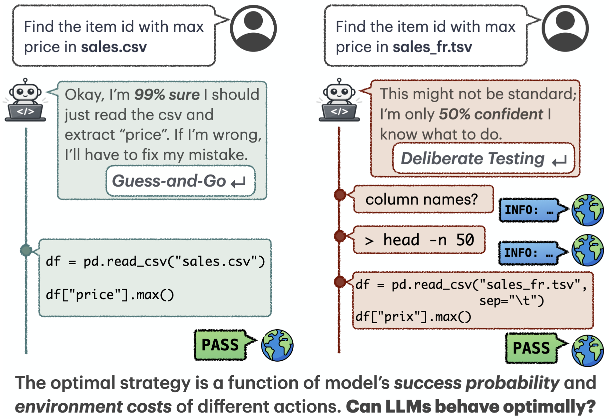
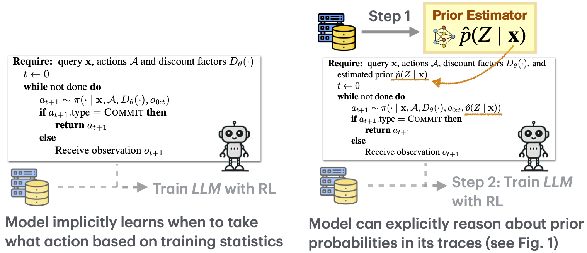
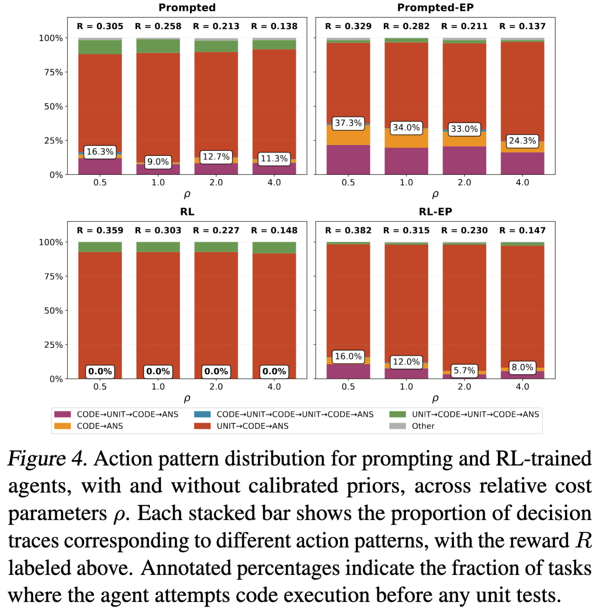
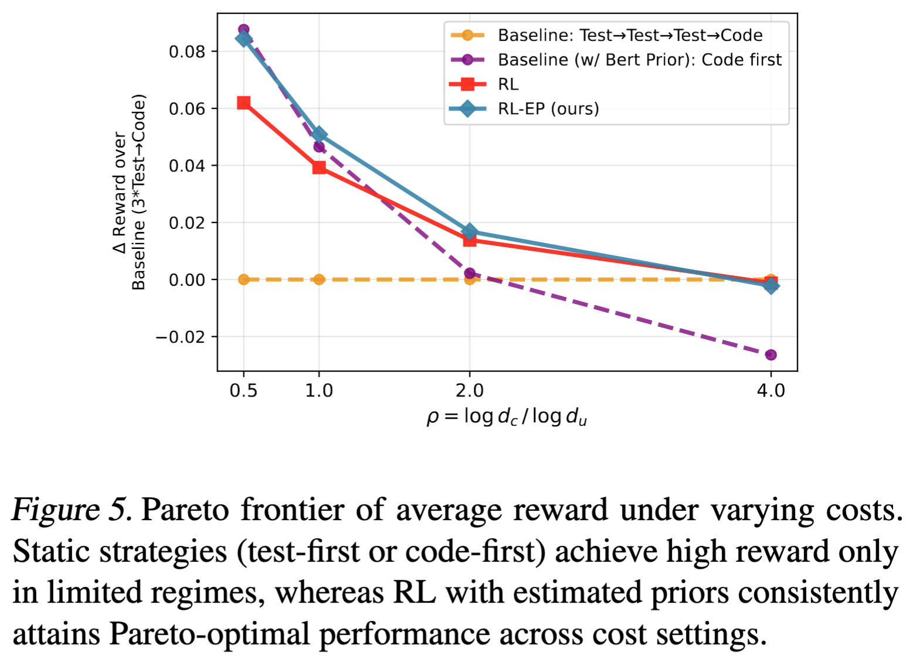

# Inducing Pareto-Optimal Environment Exploration for LLM Agents via Reasoning

Please check out our work [here](https://github.com/Wenwen-D/env-explore) 


## Abstract
>LLMs are increasingly being used for complex problems which are not necessarily resolved in a single response, but require interacting with an environment to acquire information. In these scenarios, LLMs must reason about inherent cost-uncertainty tradeoffs in when to stop exploring and commit to an answer. For instance, on a programming task, an LLM should test a generated code snippet if it is less certain about the correctness of that code; the cost of writing a test ("exploration") is nonzero, but typically lower than the cost of making a mistake. In this work, we show that we can induce LLMs to explicitly reason about balancing these uncertainty-cost tradeoffs, then perform Pareto-optimal information seeking. We formalize multiple tasks, including information retrieval and coding, as sequential decision-making problems under uncertainty. Each problem has latent information that can be reasoned about via a prior which is passed to the LLM agent. By feeding the LLM this additional context, LLMs are able to reason in fundamentally different ways about cost-uncertainty tradeoffs and tackle challenging interaction settings. This improvement is preserved even when performing RL on a test set. Our findings suggest that making cost-benefit tradeoffs explicit can help agents discover more optimal decision-making strategies.

<p align="center">
    
</p>


## Table of Contents
1. [Installation](#installation)
2. [Tasks and Data](#data)
3. [Evaluation and Training](#train-and-evaluate)
4. [How to Cite](#how-to-cite)
## Installation
Create virtual environment and install the codebase and relevant packages:
```
conda create -n env_explorer python=3.11
conda activate env_explorer

cd ./env_explorer
pip install -e .
```
## Tasks and Data
The data for each task and code used to generate them are located under [`./env_explorer/data/`](./env_explorer/data/) directory.
- Task 0 - Pandora's Box Problem (Proof-of-Concept Task)

    In this abstract toy setting, a decision maker is presented with $n$ boxes where one of them contains a prize and they need to pick the correct one to receive positive reward. They may delay the decision to inspect the boxes sequentially at a cost, and their final reward will be discounted by the exploration costs.

- Task 1 - Knowledge QA with Optional Retrieval

    In the QA setting, the model decide whether to rely on its parametric knowledge or defer commitment and retrieve additional evidence at a cost.

- Task 2 - Coding with Selective Testing

    Coding agents can choose to perform careful verification, such as running unit tests or partial execution, or direcly return a solution promptly based on their current information and belief.

## Evaluation and Training
<p align="center">
    
</p>

The scripts for running evaluation on the tasks are at [`./env_explorer/scripts`](./env_explorer/scripts)

Example usage:
- Task [Pandora](./env_explorer/scripts/run_eval_pandora.py):
    ```
    python run_eval_pandora.py -m {MODEL_NAME} \
        -t ../data/pandora_data/pandora_tasks.json \
        --remote_model --url "127.0.0.1:8000"  \ # spin up local model with vllm
        --thinking # optional arg to enable thinking mode
    ```
- Task [QA](./env_explorer/scripts/run_eval_popqa.py):
    ```
    python run_eval_popqa.py -m {MODEL_NAME} \
        -t ../data/popqa_data/popqa_test_3_from_0.1_to_0.65.json \
        -o {OUT_IDENTIFIER} --remote_model --url "127.0.0.1:8000" \
        --do_retrieve --p_ret 0.57 \ 
        --thinking
    ```
- Task [Code](./env_explorer/scripts/run_eval_code.py):
    ```
    python run_eval_code.py -m {MODEL_NAME} \
    -t ../data/code_explore_data/code_explorer_balanced_data/csv_explore_tasks_test.json \
    -o {OUT_IDENTIFIER} --remote_model --url "127.0.0.1:8000" \
    --max_turns 8 \
    --calibrator {PRIOR_ESTIMATOR_PATH} \ optional, provide explicit prior estimation for the agent
    --rho {RHO_VALUE} \ -1: use the rho values in the task json file, or use specified rho value
    --thinking 
    ```


For Task [Code](./env_explorer/scripts/run_eval_code.py), we compare the model performance with RL training under two different setups: without (RL) or with explicit prior estimation (RL-EP). 

The training pipeline builds upon implementations from [EasyR1](https://github.com/hiyouga/EasyR1) and [VeRL](https://github.com/verl-project/verl). The corresponding training scripts are listed below:
```
cd ExploreReason_train/EasyR1/training/
bash train_code_test_noprior.sh # RL baseline
bash train_code_test.sh # RL-EP method
``` 

🌟 Results show that we can induce LLMs to reason about Pareto optimality of their actions and achieve better cost-performance tradeoffs.


<div style="display: flex; justify-content: center; align-items: center; gap: 20px;">
  
  
</div>

### How to Cite
If you found our work useful, please consider citing our work.
